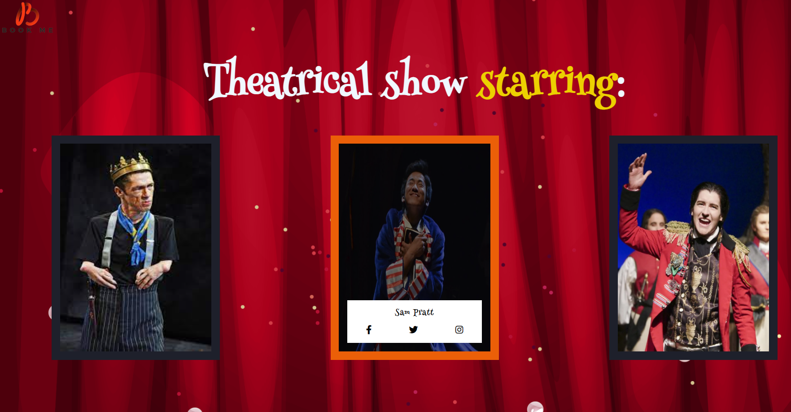
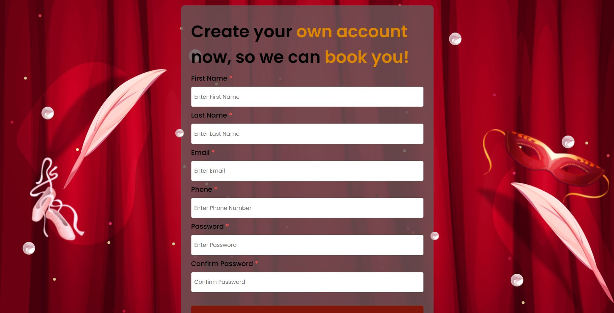

# Project Name: bookme

### What is the goal of this website?
 A site for selling and booking tickets for theatrical performances of masked faces	🎭.
### 🌍 Live Demo :
[Bookme](https://bookmeticket.netlify.app/) - "Responsive for laptop and computer only"
### Authors:
* 	👩💻Yara Jehad Rabaya
_______________________________________________________________________________________________________________________
### Project Type ?
Front end 
_______________________________________________________________________________________________________________________
### Features:
#### *countdown. timer

#### *Presentation of theatrical actors.

#### *User registration :
###### 1-📧Enter the user's email.
###### 2-✏️Enter the first and second name.
###### 3-	📲Enter the phone number.
###### 4-🔐Enter the password and re-confirm it.

______________________________________________________________________________________________________________________
### Languages used?
###### HTML
###### CSS
###### JS
###### NOTE: "Responsive for laptop and computer only"
_______________________________________________________________________________________________________________________
### Pictures of the website design:

